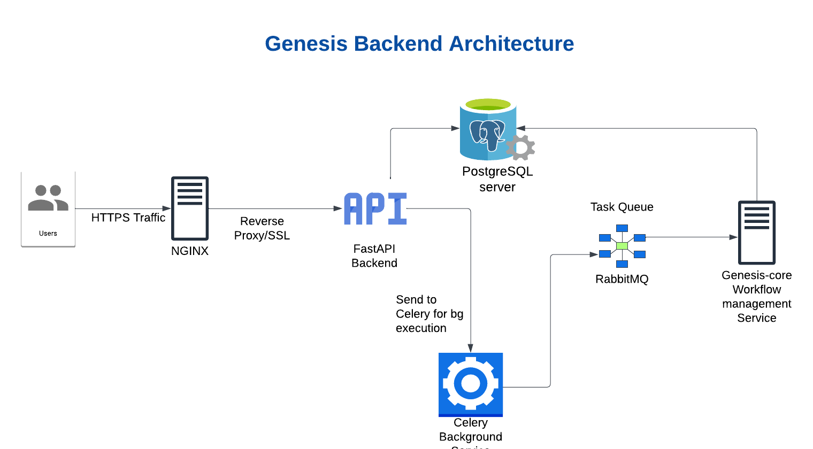

# Genesis Backend Services



A distributed backend system that powers the Genesis-GPT platform, built with FastAPI, RabbitMQ, Celery, and PostgreSQL for handling complex workflow management and autonomous agent task processing.

## Tags

`FastAPI` `Python` `RabbitMQ` `Celery` `PostgreSQL` `Microservices` `Docker` `JWT` `REST API` `Asynchronous Processing` `Task Queue` `Database` `Workflow Automation`

## Architecture Overview

The backend consists of three main microservices:

1. **FastAPI Service** (`fastapi_service/`)
   - RESTful API endpoints for client communication
   - JWT-based authentication and authorization
   - PostgreSQL database integration
   - Rate limiting and security middleware
   - API routes:
     - `/auth` - Authentication endpoints
     - `/users` - User management
     - `/messages` - Message chain handling
     - `/components` - System components
     - `/background` - Background task management

2. **Dispatcher Service** (`dispatcher_service/`)
   - Message routing and workflow orchestration
   - RabbitMQ consistent hash exchange implementation
   - Agent management system:
     - Content Writer Agent
     - File Read/Write Agents
   - Chain-based message processing
   - Real-time message dispatching

3. **Celery Service** (`celery_service/`)
   - Asynchronous task processing
   - Background job execution
   - Integration with RabbitMQ task queue
   - Worker scaling capabilities

## Prerequisites

- Python 3.10+
- PostgreSQL 13+
- RabbitMQ 3.8+
- Docker & Docker Compose (optional)

## Local Development Setup

1. **Environment Setup**:
```bash
# Create and activate virtual environment
python -m venv venv
source venv/bin/activate  # On Windows: venv\Scripts\activate

# Install dependencies
pip install -r requirements.txt
```

2. **Start RabbitMQ**:
```bash
docker run -d --name rabbitmq \
    -p 5672:5672 -p 15672:15672 \
    rabbitmq:management
```

3. **Configure Environment Variables**:
```bash
# For FastAPI Service
cp fastapi_service/app/.env.example fastapi_service/app/.env
# Edit .env with your configurations
```

4. **Database Setup**:
```bash
# Create PostgreSQL database
createdb genesis_db

# Run migrations
cd fastapi_service/app
alembic upgrade head
```

## Running Services

### FastAPI Service
```bash
cd fastapi_service/app
uvicorn main:app --reload --host 0.0.0.0 --port 8000
```

### Dispatcher Service
```bash
cd dispatcher_service/app
python main.py
```

### Celery Workers
```bash
cd celery_service/app
celery -A tasks worker --loglevel=info
```

## Docker Deployment

Build and run all services using Docker Compose:
```bash
docker-compose up -d
```

## Testing

1. **Unit Tests**:
```bash
pytest fastapi_service/tests/
```

2. **Dispatcher Tests**:
```bash
cd dispatcher_service/app
python test.py      # Run test messages
python validate.py  # Verify results
```

3. **Integration Tests**:
```bash
pytest fastapi_service/tests/integration/
```

## Service Endpoints

### FastAPI Service (Default: http://localhost:8000)
- Swagger UI: `/docs`
- ReDoc: `/redoc`
- Health Check: `/health`

### RabbitMQ Management (Default: http://localhost:15672)
- Username: guest
- Password: guest

## Monitoring & Logging

- Each service maintains its own logs in the `logs/` directory
- Custom logging format includes:
  - Timestamp
  - Service name
  - Chain ID
  - Log level
  - Message

## Common Issues & Troubleshooting

1. **RabbitMQ Connection Issues**:
   - Verify RabbitMQ is running: `docker ps | grep rabbitmq`
   - Check connection URL in configuration
   - Ensure correct vhost and permissions

2. **Database Migrations**:
   - Run `alembic current` to check migration status
   - Use `alembic history` to view migration history
   - Run `alembic upgrade head` to apply all migrations

3. **Worker Issues**:
   - Check Celery worker logs
   - Verify RabbitMQ queues in management interface
   - Ensure correct broker URLs in configuration

## Development Guidelines

1. **Code Style**:
   - Follow PEP 8 guidelines
   - Use Black for code formatting
   - Run flake8 for linting

2. **Git Workflow**:
   - Create feature branches from `develop`
   - Use conventional commits
   - Submit PRs for review

3. **Documentation**:
   - Update API documentation
   - Maintain README.md
   - Document complex workflows

## Security Notes

- JWT tokens expire after 30 minutes
- API rate limiting enabled
- CORS configured for specified origins
- SSL/TLS required in production
- Secure headers implemented

## Contributing

1. Fork the repository
2. Create a feature branch
3. Make your changes
4. Run tests
5. Submit a pull request

## License
